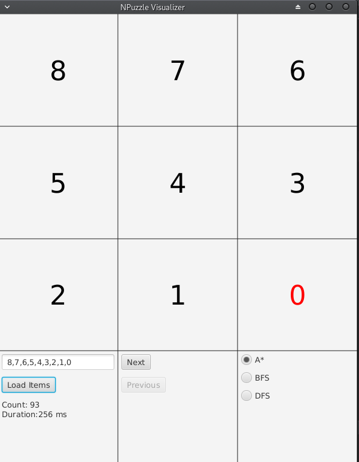

# N-Puzzle GUI

A graphical user interface for 8-Puzzle game implemented using JavaFX framework.

## Features

- Uses the `Npuzzle` library [repo](https://github.com/shakram02/Npuzzle)
- Add input in simple manner, just describe the puzzle using comma separated text
- Visualize the steps of the solution
- Clear representation of the graph
- Displays the computation duration
- Displays number of steps in solution